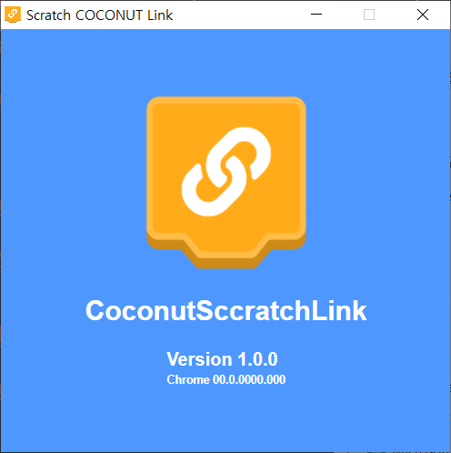

# coconut-link-desktop

    

Coconut Link is an application that provides local hardware connection support for Coconut online web pages.

## Getting Start

## Bug Report

You can submit the bug log in issues of this project.
